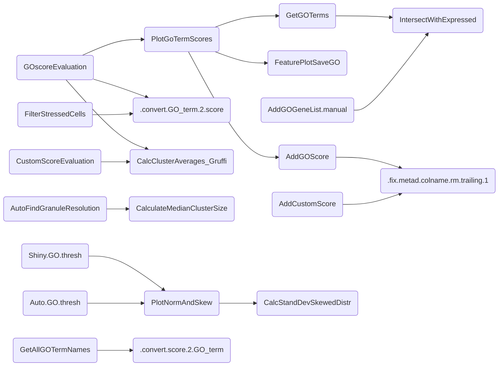

## Function relationships

 > (of connected functions)

 *created by `convert_igraph_to_mermaid()`*

## List of Functions in gruffi.R (31)

Updated: 2024/02/15 00:28

- #### 1 `ReassignSmallClusters()`

  Reassign granules (clusters) smaller than X to nearby granules based on 3D UMAP coordinates.

- #### 2 `CalculateMedianClusterSize()`

  Calculate Median Cluster Size. This function calculates and returns the median size of clusters for a given assay  and resolution in a Seurat object. It provides an option to display the median size via message.

- #### 3 `GetGOTerms()`

  GetGOTerms. Get GO Terms

- #### 4 `GetAllGOTermNames()`

  Show All GO Terms in an Object, and retrieve corresponding names using AnnotationDbi. Retrieves and optionally annotates all GO term identifiers present in the  metadata of a Seurat object. It identifies columns starting with 'Score.GO',  extracts the corresponding GO terms, retrieves tge corresponding term-names using AnnotationDbi,  and optionally saving them back into the object.

- #### 5 `AddGOGeneList.manual()`

  Add a GO-term gene list under obj@misc$GO$xxxx.

- #### 6 `AddGOScore()`

  Add GO Score to a Seurat object

- #### 7 `AddCustomScore()`

  Add a custom gene expression score from a set of genes provided to the  Seurat single cell object. Calculates Score for gene set. Fixes name.

- #### 8 `GOscoreEvaluation()`

  GO-score evaluation for filtering.

- #### 9 `CustomScoreEvaluation()`

  Custom gene-set derived score evaluation for filtering.

- #### 10 `Shiny.GO.thresh()`

  Launch Shiny App for GO Term-based Thresholding. Launches a Shiny application to interactively apply GO term-based thresholding  for identifying stressed cells in a Seurat object. This function calculates the  "granule average GO-scores" for individual GO terms and updates the object with a combined stress  identification based on these thresholds.#'

- #### 11 `Auto.GO.thresh()`

  Automated GO Term-based Thresholding without using a Shiny app.. Automatically applies granular GO term-based thresholding to identify stressed cells  in a Seurat object without launching a Shiny app. This function calculates the  "granule average GO-scores" for individual GO terms and updates the object with a combined stress  identification based on these thresholds.

- #### 12 `FilterStressedCells()`

  Filter Stressed Cells from a Seurat Object. Identifies and filters stressed cells based on specified GO terms and a quantile threshold.  It supports optional plotting of exclusion results and saving of modified datasets.

- #### 13 `PlotGoTermScores()`

  Plot GO-term scores.

- #### 14 `FeaturePlotSaveCustomScore()`

  Plot and save a Seurat FeaturePlot with a custom score in the meta data.

- #### 15 `FeaturePlotSaveGO()`

  Plot and save a Seurat FeaturePlot from a GO-score.

- #### 16 `PlotClustSizeDistr()`

  Plot cluster size distribution.

- #### 17 `PlotNormAndSkew()`

  Plot normal distribution and skew.

- #### 18 `UMAP3Dcubes()`

  UMAP with 3D cubes.

- #### 19 `GrScoreUMAP()`

  Wrapper for clUMAP with Thresholding and Plotting. This function applies thresholding to granule scores within a specified object and column,  inverts the thresholding if a specific miscellaneous name is provided, and then calls clUMAP  for plotting based on the thresholded values.

- #### 20 `GrScoreHistogram()`

  Histogram Visualization of Granule Scores with Threshold. Plots a histogram of granule scores from a specified column within a Seurat object,  with a vertical line denoting a threshold. The function allows for an optional  inversion of filtering logic based on the `miscname` and `auto` parameters.

- #### 21 `ClusterUMAPthresholding()`

  clUMAP with threshold value.

- #### 22 `CalcTranscriptomePercentageGO()`

  Calculate the percentage of transcriptome, for a given GO-term gene set already stored`in obj@misc$GO[[GO.score]].

- #### 23 `CalcTranscriptomePercentage()`

  Calculate the percentage of transcriptome, for a given gene set.

- #### 24 `CalcStandDevSkewedDistr()`

  Calculate Standard Deviation for Skewed Distributions. Computes a modified standard deviation for skewed distributions by mirroring data points about the mean.  This approach aims to reflect the skewed part of the distribution to better understand its spread.

- #### 25 `CalcClusterAverages_Gruffi()`

  Calculate granule (cluster) averages scores.

- #### 26 `GetGruffiClusteringName()`

  Retrieve First Clustering Run or First Matching Pattern Run. Fetches the first clustering run from a Seurat object,  optionally filtered by a specific pattern (e.g., ".reassigned").

- #### 27 `CleanDuplicateScorenames()`

  Remove duplicate scorenames from obj@mata.data.

- #### 28 `IntersectWithExpressed()`

  Intersect a gene set with the list of expressed genes.

- #### 29 `.convert.GO_term.2.score()`

  .convert.GO_term.2.score. Convert a string GO_term-name to Score-name.

- #### 30 `.convert.score.2.GO_term()`

  .convert.score.2.GO_term. Convert a string Score-name to GO_term-name.

- #### 31 `.fix.metad.colname.rm.trailing.1()`

  .fix.metad.colname.rm.trailing.1. Fix malformed (suffxed) column names in obj@meta.data. When running AddGOScore(),  a '1' is added to the end of the column name. It is hereby removed.

